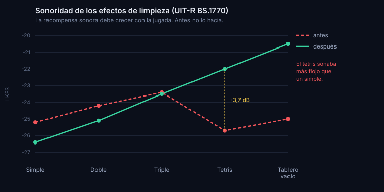

# 17 · Sonoridad medida de los efectos

- **Fecha:** 2026-09-08 · **Estado:** vigente
- **Tema del backlog:** afinar los efectos de sonido, que estaba a la espera de alguien que escuchara y comparara.

## Contexto / pregunta

El backlog daba este tema por bloqueado: afinar sonidos parece cosa de oído, y aquí no hay ninguno. La pregunta era si de verdad todo el tema necesita escuchar, o si hay una parte que se puede medir. La hay: la sonoridad relativa entre efectos es un número, no un gusto, y la relación de orden entre ellos la dicta el propio juego.

## Hallazgos

### Cómo se mide la sonoridad de verdad

La Recomendación UIT-R BS.1770-5 define el algoritmo estándar. Tiene tres partes que importan aquí:

1. **Un filtro previo de dos etapas**, llamado ponderación K, porque el oído no pesa igual todas las frecuencias. La primera etapa modela el efecto acústico de la cabeza, la segunda es un paso alto. La recomendación publica los coeficientes exactos de ambos filtros de segundo orden para 48 kHz, y advierte de que a otra tasa de muestreo harían falta otros valores.

2. **La media cuadrática de la señal filtrada** sobre el intervalo de medida, y la sonoridad como `LK = −0,691 + 10 log₁₀(z)`.

3. **Un recorte por bloques** de 400 ms solapados al 75 %, con umbral absoluto de −70 LKFS.

El tercer punto **no aplica a este proyecto**, y conviene decirlo en voz alta: la propia recomendación indica que los bloques incompletos del final se descartan, y los efectos del juego duran entre 26 y 1310 ms, casi todos por debajo de un bloque. Lo que sí aplica es el filtro y la media cuadrática sobre la duración completa del efecto.

El valor de −0,691 no es arbitrario: compensa la ganancia del filtro a 1 kHz, de modo que un tono de 1 kHz a plena escala mide −3,01 LKFS. Eso sirve de comprobación de que la implementación es correcta. La nuestra da **−3,004**.

EBU R 128 fija el objetivo de −23 LUFS para emisión, con ±0,5 LU de tolerancia. No es aplicable a efectos de un juego, que son eventos y no programa continuo, pero confirma el orden de magnitud de lo que se considera una diferencia perceptible: **medio decibelio es la tolerancia de un estándar de emisión, así que un escalón de un decibelio o más es una diferencia real, no ruido de medida.**

### Lo que salió al medir los 26 efectos

El parámetro de volumen de cada preset no predice la sonoridad, porque cada uno tiene forma de onda, envolvente y duración distintas. Medidos de verdad, la escalera de recompensa estaba rota:

| Jugada     | Puntos | Volumen del preset | Sonoridad medida |
| ---------- | ------ | ------------------ | ---------------- |
| Simple     | 100    | 0,60               | −25,2 LKFS       |
| Doble      | 300    | 0,65               | −24,2 LKFS       |
| Triple     | 500    | 0,70               | −23,4 LKFS       |
| **Tetris** | 800    | **0,90**           | **−25,7 LKFS** ✗ |

El tetris, con el volumen nominal más alto de los cuatro, era **el más flojo de todos**: 2,3 dB por debajo del triple y medio decibelio por debajo de un simple. La jugada que da más puntos sonaba menos que la que da menos.

No era el único desorden. Vaciar el tablero, que es lo más raro que puede pasar, medía −25,0 y quedaba por debajo del giro de la T, de subir de nivel y del triple. Y la caída rápida, que suena en **cada** pieza, estaba en −24,4: el cuarto sonido más fuerte del juego, compitiendo de tú a tú con las limpiezas.

### Por qué pasó

Los presets se escribieron uno a uno, a ojo, ajustando el número del volumen sin comparar el resultado con los demás. Es el fallo clásico de mezclar sin medir: cada sonido suena razonable por separado y el conjunto está descompensado.

## Opciones y comparativa

| Opción                                        | Qué aporta                                                                        |
| --------------------------------------------- | --------------------------------------------------------------------------------- |
| Esperar a que alguien lo escuche              | Deja el defecto en producción por tiempo indefinido                               |
| Normalizar todo a la misma sonoridad          | Fácil de medir, pero destruye la jerarquía: un simple sonaría igual que un tetris |
| Fijar una jerarquía derivada de la puntuación | El orden ya lo dicta el juego; solo hay que hacer que el audio lo respete         |

## Decisión recomendada

La tercera. El orden no es una opinión: la tabla de puntuación ya establece qué jugada vale más que cuál, y el sonido debe seguir ese mismo orden. Se ajustan los volúmenes para que la escalera sea monótona con un escalón de aproximadamente decibelio y medio, y se protege con pruebas.

Lo que **no** se toca es el timbre, el tono ni la envolvente de ningún efecto. Eso sí necesita oído, y sigue esperando. Aquí solo se corrige el equilibrio entre unos y otros, que es lo medible.

## Acción

- Medidor de sonoridad según la recomendación, con la comprobación del tono de 1 kHz.
- Ajuste de los volúmenes de las limpiezas, los giros, vaciar el tablero y la caída rápida.
- Pruebas que fijan las invariantes: nada satura, la recompensa crece con la jugada, el giro completo supera al mini, vaciar el tablero es lo más sonoro, y los sonidos de cada pieza no compiten con los de recompensa.

## Riesgos

El medidor usa los coeficientes de 48 kHz y las pruebas sintetizan a esa tasa, mientras que en el navegador la tasa la decide el dispositivo. Afecta por igual a todos los efectos, así que el orden relativo, que es lo que se fija, no cambia; los valores absolutos sí variarían un poco.

Subir el tetris y vaciar el tablero deja sus picos en −11,8 y −11,4 dBFS, todavía con mucho margen antes de saturar. Hay además un compresor de dinámica en la salida que actúa de red de seguridad.

Queda pendiente, y sigue necesitando a una persona: si el timbre de cada efecto es el adecuado y si la mezcla con la música funciona en un altavoz real.

## Referencias

- https://www.itu.int/rec/R-REC-BS.1770/en — Recomendación UIT-R BS.1770-5 (noviembre de 2023), algoritmos para medir la sonoridad y el pico real. Coeficientes de las tablas 1 y 2, ecuación (1) y fórmula de sonoridad.
- https://tech.ebu.ch/publications/r128 — EBU R 128 v5.0 (noviembre de 2023), objetivo de −23 LUFS y tolerancia de ±0,5 LU.
- Informe 03 de este directorio, sobre audio y música, donde se eligieron los presets originales.
