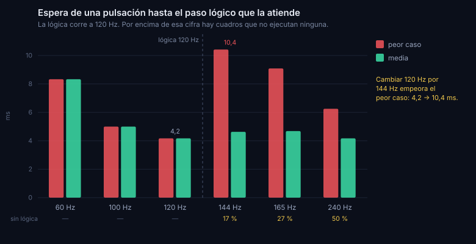

# 18 · Latencia de entrada

- **Fecha:** 2026-09-08 · **Estado:** vigente
- **Tema del backlog:** latencia de entrada, de la pulsación al cuadro dibujado.

## Contexto / pregunta

En un juego de bloques que caen, el retardo entre pulsar y ver el resultado es lo que separa una colocación limpia de una torcida. La pregunta era doble: cuánto tarda de verdad, y si se puede recortar un cuadro en algún punto del camino.

## Hallazgos

### Qué garantiza la plataforma

La especificación de HTML fija el orden dentro de un cuadro. En los pasos de dibujado, primero se ejecutan las funciones de animación registradas y **después** se recalculan estilos y disposición:

> «For each doc of docs, run the animation frame callbacks for doc […]. For each doc of docs: […] Recalculate styles and update layout for doc.»

Las tareas del bucle de eventos, entre ellas el reparto de los eventos de teclado, se procesan antes de esos pasos. Es decir, **una pulsación que llega durante el cuadro N ya está en la cola del juego cuando corre la función de animación del cuadro N+1**. No hay forma de adelantarla: es el mínimo que permite la plataforma.

El estándar DOM añade un dato aprovechable: `Event.timeStamp` marca **cuándo ocurrió** el suceso, no cuándo se repartió. Restándole `performance.now()` en el manejador se obtiene lo que el navegador tardó en entregarlo.

### Lo medido en el juego

Cuarenta pulsaciones durante una partida real, en el navegador:

| Tramo                                      | Mediana | Percentil 95 |
| ------------------------------------------ | ------- | ------------ |
| De ocurrir la pulsación a procesarla en JS | 0,20 ms | 1,80 ms      |
| De procesarla al siguiente cuadro          | 7,80 ms | 16,30 ms     |
| **Total**                                  | 8,00 ms | 16,50 ms     |

El primer tramo es despreciable: el manejo de teclado no cuesta nada y no acumula retraso. El segundo es la espera al cuadro, y su mediana de 7,8 ms es exactamente medio cuadro a 60 Hz, que es lo que sale de una pulsación que cae en un momento cualquiera del intervalo. **Es el mínimo teórico, no hay cuadro que recortar.**

Se comprobó además si el arranque del bucle mezcla bases de tiempo, porque fija su referencia con `performance.now()` y luego recibe la marca del cuadro, que es el instante en que el cuadro empezó. Si la segunda fuera anterior a la primera, el acumulador retrocedería. En treinta arranques la diferencia salió siempre positiva, entre 1,0 y 4,5 ms. **No es un problema real**, y conviene dejarlo escrito para no volver a sospecharlo.

### Dónde sí hay un problema: las pantallas de más de 120 Hz

La simulación avanza a paso fijo de 120 Hz, un paso cada 8,33 ms. Cuando la pantalla refresca más deprisa que eso, hay cuadros en los que no cabe ningún paso, y una pulsación que llegue en uno de ellos espera al siguiente:

| Refresco | Cuadros sin lógica | Espera media | Peor espera  |
| -------- | ------------------ | ------------ | ------------ |
| 60 Hz    | 0,0 %              | 8,33 ms      | 8,33 ms      |
| 100 Hz   | 0,0 %              | 5,00 ms      | 5,00 ms      |
| 120 Hz   | 0,0 %              | 4,17 ms      | 4,17 ms      |
| 144 Hz   | 16,7 %             | 4,63 ms      | **10,42 ms** |
| 165 Hz   | 27,3 %             | 4,68 ms      | 9,09 ms      |
| 240 Hz   | 50,0 %             | 4,17 ms      | 6,25 ms      |

La media apenas cambia, pero el peor caso a 144 Hz es **dos veces y media el de 120 Hz**. Quien cambia una pantalla de 120 Hz por una de 144 Hz para ganar reflejos empeora su peor caso, que es justo lo contrario de lo que espera.

No es un fallo de implementación, es aritmética: **con un reloj de 120 pasos por segundo no se pueden dar 144 pasos**. La única forma de que cada cuadro procese entrada es que la frecuencia lógica iguale o supere la de la pantalla.

### Por qué no se sube la frecuencia hoy

Subirla a 240 Hz costaría poco en cálculo: el paso lógico son 35 µs, así que pasar de 120 a 240 pasos por segundo lleva el gasto del 0,4 % al 0,8 % de un núcleo.

El problema son las repeticiones. Se guardan como semilla más pulsaciones con su marca de tiempo, y al reproducirlas se aplican cuando el tiempo simulado las alcanza. Con paso de 8,33 ms una pulsación anotada en el milisegundo 10 se aplica en el 16,67; con paso de 4,17 ms se aplicaría en el 12,5. **Momento distinto, partida distinta.** Todas las repeticiones guardadas dejarían de reproducirse fielmente, y el lector rechaza las versiones que no reconoce.

Eso convierte lo que parecía un ajuste de una constante en un cambio con pérdida de datos del usuario. Corresponde a una decisión registrada, no a un retoque.

## Opciones y comparativa

| Opción                                       | Qué aporta                                                               |
| -------------------------------------------- | ------------------------------------------------------------------------ |
| Subir la frecuencia lógica a 240 Hz          | Elimina los cuadros sin lógica; invalida las repeticiones guardadas      |
| Ajuste para elegir la frecuencia             | Igual de eficaz, pero añade una opción que casi nadie sabría interpretar |
| Dejarlo medido, fijado con pruebas y anotado | Sin riesgo; el caso queda visible y con su vía de solución escrita       |

## Decisión recomendada

La tercera, por ahora. La medición dice que el camino de entrada ya es el mínimo que permite la plataforma en las pantallas que usa casi todo el mundo, y que el único punto flojo afecta a un caso concreto cuya corrección tiene un coste que no es técnico sino de datos del usuario.

Lo que sí falta y se hace ahora: el bucle es el corazón del juego y **era el único módulo de su carpeta sin una sola prueba**. Se cubre con pruebas que fijan lo medido, de modo que si alguien toca el acumulador o el orden de las llamadas, se entera.

## Acción

- Pruebas del bucle: paso fijo, acumulación, tope de cuadro largo, orden de lógica antes de dibujado, y reinicio del reloj.
- Prueba de presupuesto de latencia que fija la tabla de refrescos de arriba y no deja que empeore.
- Hallazgo anotado con su vía de solución, para cuando se decida versionar las repeticiones.

## Riesgos

Las cifras del navegador salen de un Chromium sin ventana, que refresca a 60 Hz nominales y no compite con otras aplicaciones por la tarjeta gráfica. Sirven para afirmar que **no se pierde ningún cuadro por culpa del juego**, que es lo que se quería saber; no para dar un número absoluto de latencia de punta a punta, que incluiría el teclado, el compositor y la pantalla, y que necesita medirse con una cámara de alta velocidad.

La tabla por refresco es aritmética del acumulador y no depende del equipo, así que esa sí es exacta.

## Referencias

- https://html.spec.whatwg.org/multipage/webappapis.html#event-loop-processing-model — modelo de proceso del bucle de eventos: las funciones de animación se ejecutan antes de recalcular estilos y disposición.
- https://dom.spec.whatwg.org/#dom-event-timestamp — `Event.timeStamp` marca el momento en que ocurrió el suceso, no el del reparto.
- Informe 02 de este directorio, apartado 3, donde se eligió el bucle de paso fijo con acumulador.
